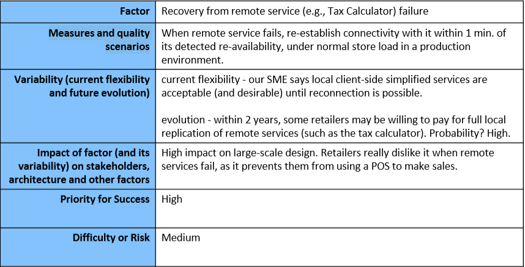

[TOC]

# SWEN30006 Notes

## Diagrams

### Use-Case Model (Chapter 6 textbook P115~174)

> Use cases are text documents, not diagrams, and use-case modelling is primarily an act of writing text, not drawing diagrams.

Three Kinds of Actors:

- **Primary actor** has user goals fulfilled through using services of the SuD (system under discussion). For example, the cashier in a sales system.
- **Supporting actor** provides services (for example, information) to the SuD. The automated payment authorization service is an example. Often a computer system, but could be an organization or person.
- **Offstage actor** has an interest in the behaviour of the use case, but is not primary or supporting; for example, a government tax agency.

Three Common Use Case Formats

- **brief** Terse one-paragraph summary, usually of the main success scenario.

  - e.g. **Process Sale:** A customer arrives at a checkout with items to purchase. The cashier uses the POS system to record each purchased item. They system presents a running total and line-item details. The customer enters payment information, which the system validates and records. The system updates inventory. The customer receives a receipt from the system and then leaves with the items.

- **casual** Informal paragraph format. Multiple paragraphs that cover various scenarios.

  - e.g. **Handle Returns:** 

    Main Success Scenario:

    Alternate Scenarios:

    If the customer paid by credit, and the reimbursement transaction to their credit account is rejected, inform the customer and pay them with cash.

    If the item identifier is not found in the system, notify the Cashier and suggest manual entry of the identifier code (perhaps it is corrupted).

    If the system detects failure to communicate with the external accounting system, ...

- **fully dressed** All steps and variations are written in detail, and there are supporting sections, such as preconditions and success guarantees.

  - e.g. refer to textbook P126

### Domain Model (Chapter 9 textbook P218~217)

A domain model may show:

- domain object or conceptual classes
- associations between conceptual classes
- attributes of conceptual classes

Common software artifacts to avoid in domain model:

- Database: e.g. SalesDatabase
- method: e.g. print()
- access modifiers: e.g. public(+), private(-), protected(#)
- datatype: e.g. float, string, etc.
- dependency: e.g. arrow from one class to another

### Design Class Diagram (Chapter 16 textbook P382)

### System Sequence Diagram (Chapter 10 textbook P272~285)

### State Machine Diagram (Chapter 29 textbook P657~669)

## Object Oriented Concepts

### GRASP (Chapter 17 textbook P409~466)

#### Controller

- Problem: What first object beyond the UI layer receives and coordinates ("controls") a system operation?
- Solution: Assign the responsibility to an object representing one of these choices:
  - Represents the overall "system", a "root object", a device that the software is running within, or a major subsystem (these are all variations of a facade controller).
  - Represents a use case scenario within which the system operation occurs (a use case or session controller) 

#### Creator

- Problem: Who creates an Class A?
- Solution: Assign Class B the responsibility to create an instance of Class A if one of these is true (the more the better):
  - B "contains" or compositely aggregates A
  - B records A
  - B closely uses A
  - B has the initializing data of A

#### Indirection

- Problem: Where to assign responsibility, to avoid direct coupling between two (or more) things? How to de-couple objects so that low coupling is supported and reuse potential remains higher?
- Solution: Assign the responsibility to an intermediate object to mediate between other components or services so that they are not directly coupled.

#### Information Expert

- Problem: What is a basic principle by which to assign responsibilities to objects?
- Solution: Assign a responsibility to the class that has the information needed to fulfil it.

#### High Cohesion

- Problem: How to keep objects focused, understandable, and manageable, and as a side effect, support Low Coupling?
- Solution: Assign responsibilities so that cohesion remains high. Use this to evaluate alternatives.

#### Low Coupling

- Problem: How to reduce the impact of change?
- Solution: Assign responsibilities so that (unnecessary) coupling remains low. Use this principle to evaluate alternatives.

#### Polymorphism

- Problem: How handle alternatives based on type? How to create pluggable software components?
- Solution: When related alternatives or behaviours vary by type (class), assign responsibility for the behaviorusing polymorphic operations to the types for which the behaviour varies. 

#### Protected Variations

- Problem: How to design objects, subsystems, and systems so that the variations or instability in these elements does not have an undesirable impact on other elements?
- Solution: Identify points of predicted variation or instability; assign responsibilities to create a stable interface around them.

#### Pure Fabrication

- Problem: What object should have the responsibility, when you do not want to violate High Cohesion and Low Coupling, or other goals, but solutions offered by Expert (for example) are not appropriate?
- Solution: Assign a highly cohesive set of responsibilities to an artificial or convenience class that does not represent a problem domain concepts something made up, to support high cohesion, low coupling, and reuse.

### GoF Design Patterns (Chapter 26 textbook P599~639)

**Gang-Of-Four:** Erich Gamma, Richard Helm, Ralph Johnson and John Vlissides

#### Adapter

Adapter pattern is a structural pattern in GoF patterns. It provides a solution on how to link objects that have incompatible interfaces. Instead of directly linking these objects, Adapter pattern suggests to have an ‘adapter’,i.e., a class that is responsible for wrapping various interfaces of these objects and providing a single interface. Hence,other objects that want to link with these objects with various interfaces are not required to know all the interfaces, but only one interface provided by the adapter. 

#### (Concrete) Factory

Concrete Factory pattern is a part of Factory Method in GoF patterns. Factory patternisacreationalpatternasitisusedtocontrolclassinstantiation.Creatinganobjectcanbea complextaskforsomeproblemsandmayrequirecomplexlogicstocontrolthiscreation.To achieve  Low Coupling and High Cohesion in GRASP principles, Concrete Factory pattern provides a solution  by defining a new class and method that are responsible for generating an object. 

#### Singleton

Singleton pattern is also a creational pattern in GoF patterns. Singleton pattern is useful  when we are sure that we need only one instance of a particular class and it will have a global point of access.  To address this design problem, Singleton pattern provides a solution by hiding constructor  and creating a method that is responsible for instantiating the class itself in order to ensure that the class will not be instantiated from outside the class.

#### Strategy

The strategy pattern is a behavioural pattern. It is useful when a system uses various  algorithms(i.e.,strategies) for a particular problem and the specific algorithm used is chosen at runtime. To achieve protected variation of GRASP principles, the Strategy pattern provides a solution by using polymorphic objects(i.e., by creating an interchangeable ‘family’ of algorithms). This pattern is often used in combination with the Factory pattern to determine which algorithm to use. 

#### Composite

The composite pattern is a structural pattern, which also offers protected variation. The pattern defines a manner in which to design a recursive tree structure of objects, where individual objects and groups can be accessed in the same manner.

#### Facade

The facade pattern is a structural pattern. This pattern is often used in real-world applications. The facade pattern is ideal when working with a large number of interdependent classes which are complicated to use. Hence, the facade pattern is used to define a simplified interface of such a complex subsystem. By using the facade pattern, the client class that uses this complex system does not need to know all the classes and methods of this complex subsystem. The client class just can simply call few functions from the facade object.

#### Observer

The observer pattern is a behavioural pattern. The observer pattern is used to allow an object, known as the subject, to publish changes to any objects that are interested(i.e.,observers) in these changes. Other observer objects that depend upon the subject can subscribe to the subject object. When changes are published from the subject object, the observer objects will be automatically notified and immediately process the changes if needed. This observer pattern provides loose coupling between the subject class and its observers. We can change any observer object without making changes to the subject object. 

#### Decorator

This is a structural pattern that allows users to add new responsibilities to an existing object without modifying its structure or subclassing. For instance, adding a class to decorate the border of a given rectangle(shape) without changing how the rectangle is currently being drawn.

### Architecture Analysis (Chapter 33 textbook P734~758)

#### Variation and Evolution Points

- **variation point** Variations in the existing current system or requirements, such as the multiple tax calculator interfaces that must be supported
- **evolution point** Speculative points of variation that may arise in the future, but which are not present in the existing requirements

#### Logical Architecture and Layers

- Logical Architecture
  - The large-scale organisation of the software classes into packages, subsystems and layers
  - Logical: not concerned with networking, physical computers, or operating system processes (cf. deployment architecture)
- Layer:
  - Coarse-grained grouping of classes, packages, or subsystems that has cohesive responsibility for a major aspect of the system

#### Layered Architecture

- Strict: Layer only calls upon the services of the layer directly below it. e.g. a network protocol stack
- Relaxed: A layer calls upon the services in several lower layers. e.g. information systems

#### Software Architecture

- the set of significant <u>decisions</u> about the organisation of a software system
- the <u>selection of the structural elements</u> and the <u>interfaces</u> by which the system is composed
- their <u>behaviour</u> as specified in the collaborations among these elements
- the <u>composition</u> of these structural and behavioural elements into progressively larger subsystems
- the <u>architectural style</u> that guides this organisation

#### Architecture Significant Non-Functional Requirements

- Usability: e.g. aesthetics and consistency in the UI
- Reliability: e.g. availability (the amount of system "up time"), accuracy of system calculations, and the system's ability to recover from failure
- Performance: e.g. throughput(the amount of material or items passing through a system or process), response time, recovery time, start-up time
- Supportability: e.g. testability, adaptability, maintainability, compatibility, configurability, installability, scalability and localizability  

#### Architecture Factor Table

